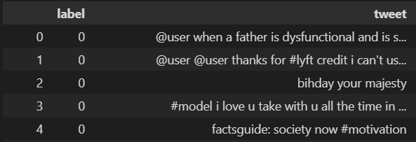

# Twitter Sentiment Analysis
This project focuses on **Twitter Sentiment Analysis Classification** using **Natural Language Processing (NLP)** techniques. The goal is to classify tweets based on their sentiment (e.g., positive (0) or negative (1) ).

---

## Input Data


## Workflow

### 1. Exploratory Data Analysis (EDA)
  - Examined tweet length distributions.
  - Analyzed the frequency of positive and negative sentiments.
  - Visualized frequent words using a WordCloud.

---

### 2. Data Preprocessing
  - **Removed Punctuations**: Eliminated unnecessary symbols such as `., !, ?`.
  - **Removed Stopwords**: Excluded common words like `the, is, and` that do not contribute to sentiment analysis.
  - **Tokenization**: Split sentences into individual words for analysis.
  - **WordCloud Creation**: Generated visualizations of the most frequent words for each sentiment category.

---

### 3. Model Development

- **Algorithm**: Naive Bayes Classifier
    - Used preprocessed text data to train the model.
    - Extracted features using tokenized words.
    - Classified tweets based on their sentiment labels.
- **Evaluation**:
    - Measured model accuracy to assess its performance.

---


## Key Libraries Used

- **Exploratory Data Analysis**:
  - `pandas`: For data manipulation and analysis.
  - `matplotlib` and `seaborn`: For data visualization.
- **Text Preprocessing**:
  - `re`: For regular expression operations.
  - `nltk`: For stopword removal and tokenization.
  - `wordcloud`: To generate WordCloud visualizations.
- **Modeling**:
  - `sklearn`: For implementing the Naive Bayes classifier and evaluating accuracy.

---

## Results

- The **WordCloud** provided insights into the most commonly used words in positive, negative, and neutral tweets.
- The Naive Bayes model achieved satisfactory accuracy for classifying sentiments.
- Classification report:
 ```
                precision  recall    F1-score   

           0       0.97      0.97      0.97      
           1       0.57      0.53      0.55     

    accuracy                           0.94    
   macro avg       0.77      0.75      0.76     
weighted avg       0.94      0.94      0.94    
```

---

## Conclusion

This project demonstrates the effectiveness of **NLP techniques** and the **Naive Bayes algorithm** in sentiment classification tasks. By leveraging EDA and preprocessing, the model provided meaningful predictions on Twitter sentiment data.

---
 
